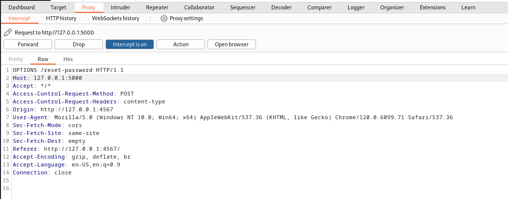
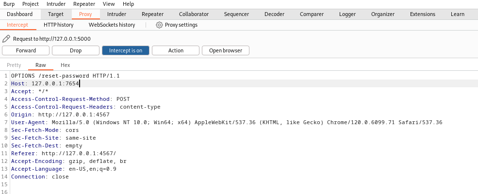
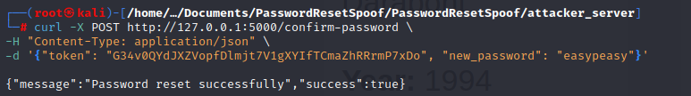

# Password Reset Spoof
A demonstration of Host Header Manipulation to exploit password reset functionality and capture reset tokens for unauthorized account access.

### Host Header Attack: Password Reset Exploitation

1. **Attacker Accesses Password Reset Form**:
   The attacker visits the target website (e.g., www.example.com) and enters the victim's email in the password reset form.

2. **Attacker Intercepts the Request**:
   Using a proxy tool (e.g., Burp Suite), the attacker intercepts the outgoing password reset request.

3. **Host Header Manipulation**:
   The attacker modifies the `Host` header from www.example.com to attacker.com.

4. **Server Generates Malicious Link**:
   The target server uses the manipulated `Host` header to generate a password reset link pointing to attacker.com.

5. **Victim Receives Email with Malicious Link**:
   The victim receives a legitimate-looking email containing the malicious link (e.g., https://attacker.com/reset-password?token=abc123).

6. **Victim Clicks the Malicious Link**:
   The victim unknowingly clicks the link, which redirects them to the attacker-controlled website.

7. **Attacker Captures Reset Token**:
   The attacker’s website captures the password reset token (e.g., abc123) from the victim's request.

8. **Attacker Uses the Token**:
   The attacker sends the captured token to the legitimate password reset endpoint on www.example.com and resets the victim's password, gaining control over their account.


# Step-by-Step Guide to Running the Project

This guide explains how to set up and run the project.

## Update Credentials:


Explanation: This step ensures the system uses the specified email credentials for sending reset emails as part of the scenario demonstration.


### Step 1: Start Docker Compose
Run the following command to start all services:
```bash
docker-compose up --build
```

### Step 2: Open Localhost Ports
Access the services running on your local machine through the following ports:

1. **Backend**: Open your browser and navigate to: http://localhost:5000
2. **Frontend**: Open your browser and navigate to: http://localhost:4567


### Step 3: Enter Victim's Email for Password Reset
In this step, the attacker enters the victim's email address into the password reset form on the legitimate website to initiate the password reset process.

Example Screenshot:


Explanation: This step triggers the password reset process, and the server will send a reset link to the victim’s email address.

### Step: Capturing and Modifying the Request in Burp Suite

1. **Capture the Original Request**:
   Using **Burp Suite**, intercept the outgoing password reset request after entering the victim's email. The original `Host` header points to the legitimate domain (e.g., `www.example.com`).

   **Original Request Screenshot**:
   

2. **Modify the `Host` Header**:
   In **Burp Suite**, modify the `Host` header to point to the attacker's domain (e.g., `attacker.com`). This change ensures that the server generates the reset link using the malicious domain.

   **Modified Request Screenshot**:
   

### Step 4: Victim Receives Email and Clicks Malicious Link

In this step, the victim receives an email containing a password reset link generated by the manipulated `Host` header. The link appears legitimate but redirects to the attacker's website.

Example Screenshot:


Explanation: The victim, unaware of the attack, clicks the link (e.g., `https://attacker.com/reset-password?token=abc123`). This action redirects them to the attacker's web server, which captures the reset token from the request.


### Step 5: Attacker Captures the Token in Attacker Server

When the victim clicks the malicious reset link, they are redirected to the attacker's server. The attacker’s server (`attacker_server/main.py`) captures the reset token from the URL.

Code in `attacker_server/main.py`:
```python
@app.route('/reset-password', methods=['GET'])
def capture_token():
    token = request.args.get('token')
    if token:
        print(f"Captured Token: {token}")
        with open("captured_tokens.txt", "a") as f:
            f.write(f"Captured Token: {token}\n")
        return jsonify({"success": True, "message": "Token captured successfully"}), 200
    else:
        return jsonify({"success": False, "message": "No token found in the request"}), 400
```

### Step 6: Attacker Sends the Payload to Server Endpoint

Using the captured reset token, the attacker crafts a malicious payload and sends it to the legitimate server’s password reset confirmation endpoint (`/confirm-password`). This resets the victim's password to one chosen by the attacker.

Example Payload:
```bash
curl -X POST http://127.0.0.1:5000/confirm-password \
-H "Content-Type: application/json" \
-d '{"token": "G34v0QYdJXZVopfDlmjt7V1gXYIfTCmaZhRRrmP7xDo", "new_password": "easypeasy"}'
```



### Step 7: Attacker Logs in Using Victim's Email and New Password
After successfully resetting the victim's password, the attacker can now log in to the victim's account using the email and the new password they set.


# Conclusion
This demonstration highlights the risks associated with insecure password reset implementations and the exploitation of trust in the `Host` header. By manipulating the reset process, attackers can capture sensitive tokens, gain unauthorized access to user accounts, and compromise the security of the system. Implementing proper validations, such as whitelisting `Host` headers, securing reset tokens, and employing multi-factor authentication, can help mitigate these attacks.

# Project Explanation and Objective

This project demonstrates the concept of **Host Header Manipulation** in a controlled environment for learning and testing purposes. Here's what I set up:

### Setup Overview:
1. **Backend**: 
   - Represents the legitimate server backend.
   - Handles password reset functionality, including generating reset tokens and validating them.

2. **Frontend**:
   - Serves as the legitimate frontend for the target website.
   - Includes pages like login, reset password, etc.

3. **Attacker Server**:
   - A malicious server controlled by the attacker.
   - Captures reset tokens when the victim interacts with a malicious link.

---

### Purpose:
- **Concept Clarity**:
  - This setup is designed to understand and demonstrate how Host Header Manipulation works in practice.
  - It assumes that each container represents a different domain (based on ports).
- **Testing Locally**:
  - By running all containers locally on different ports, I simulate real-world interactions without requiring a live environment or domain names.
- **Learning**:
  - The primary goal is to learn and test the security vulnerabilities associated with improper Host Header validation in web applications.

---

### Important Note:
This setup is solely for educational purposes and testing in a controlled environment. It should not be used for malicious activities or to exploit vulnerabilities in real-world systems. Always follow ethical guidelines when working on cybersecurity-related projects.
